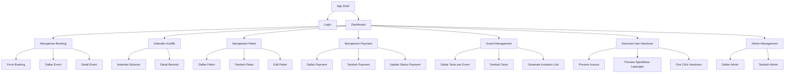
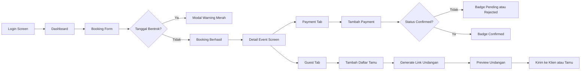
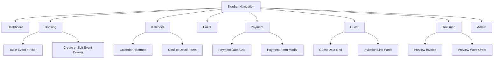
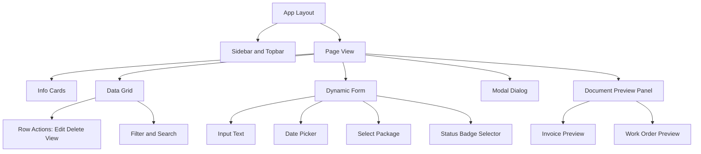
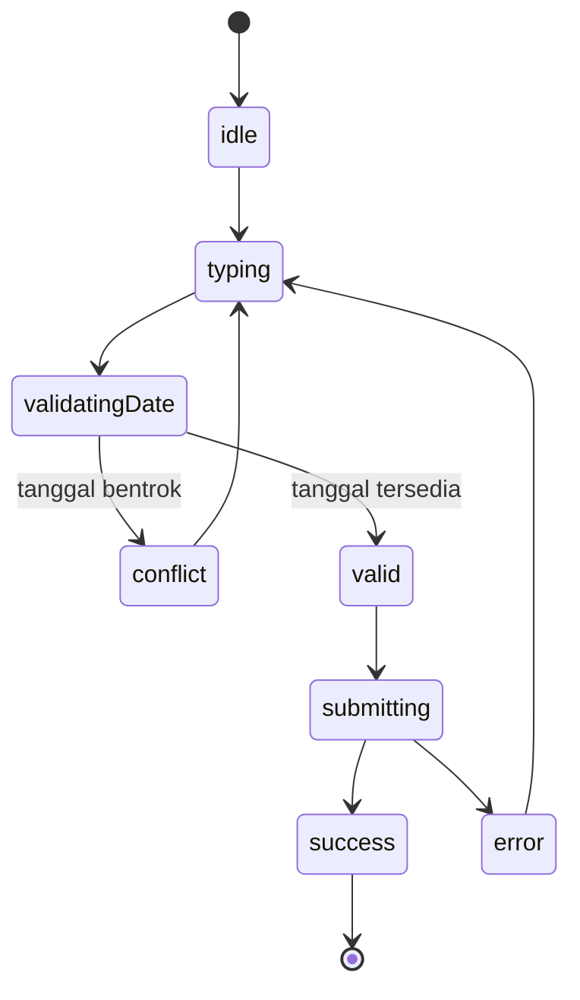
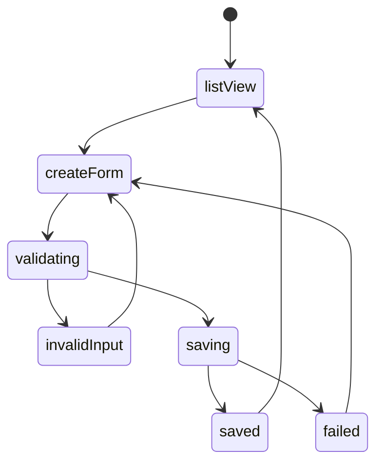
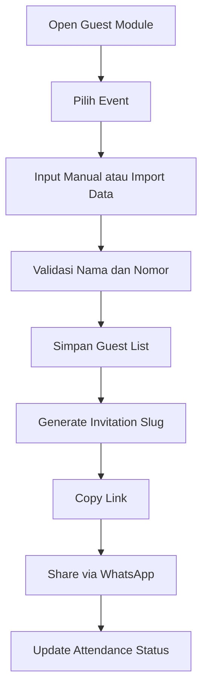

# Diagram Interface Lengkap - Dream Syariah Wedding Organizer

## 1. Information Architecture (Sitemap)



## 2. User Flow Antarmuka Admin (End to End)



## 3. Screen Map dan Navigasi Sidebar



## 4. Wireframe Konseptual - Dashboard Desktop

```mermaid
flowchart TB
    subgraph PAGE[Dashboard Desktop - Split View]
        A[Topbar: Search | Profile | Quick Actions]
        B[Sidebar: Menu Utama]
        C[Main Left: Form Input Booking atau Payment]
        D[Main Right: Live Preview Invoice atau Summary Event]
        E[Bottom Panel: Activity Log dan Notification]
    end

    A --> C
    B --> C
    C --> D
    D --> E
```

## 5. Wireframe Konseptual - Mobile or Tablet

```mermaid
flowchart TB
    subgraph MOBILE[Mobile or Tablet]
        A1[Header: Title + Action]
        A2[Segmented Tabs: Event | Payment | Guest]
        A3[Content Card List]
        A4[Primary CTA Bottom Button]
        A5[Bottom Navigation]
    end

    A1 --> A2
    A2 --> A3
    A3 --> A4
    A4 --> A5
```

## 6. Component Hierarchy Interface



## 7. UI State Diagram - Booking Screen



## 8. UI State Diagram - Payment Screen



## 9. Guest Interface Flow (Input sampai Link)



## 10. Design Tokens Interface

- Warna utama:
  - Navy: #0B2545
  - Gold: #B89336
  - White: #FDFDFD
  - Cream Surface: #F8F4E8
- Tipografi:
  - Heading: Lora
  - Body: Inter
- Prinsip visual:
  - Layout berbasis kartu
  - Split view pada desktop
  - Touch target minimum 44px untuk tablet
