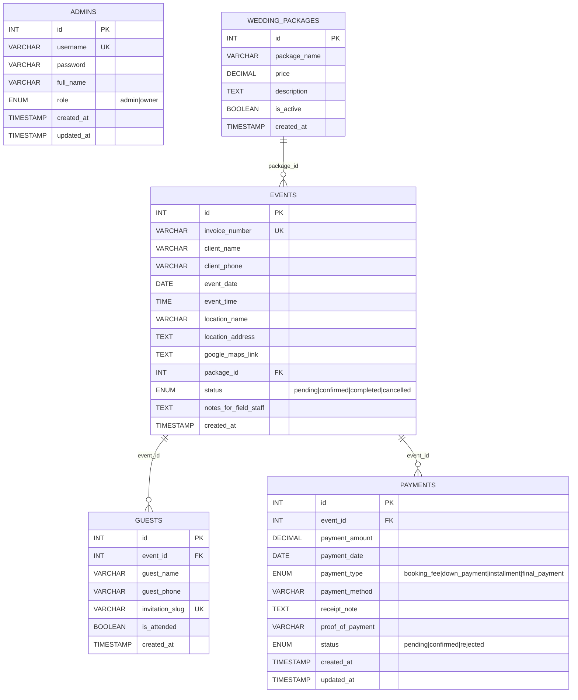
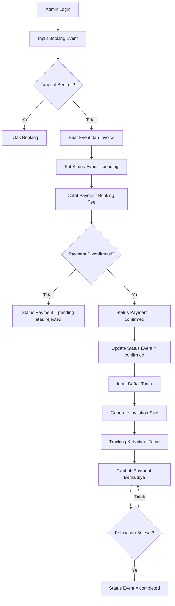
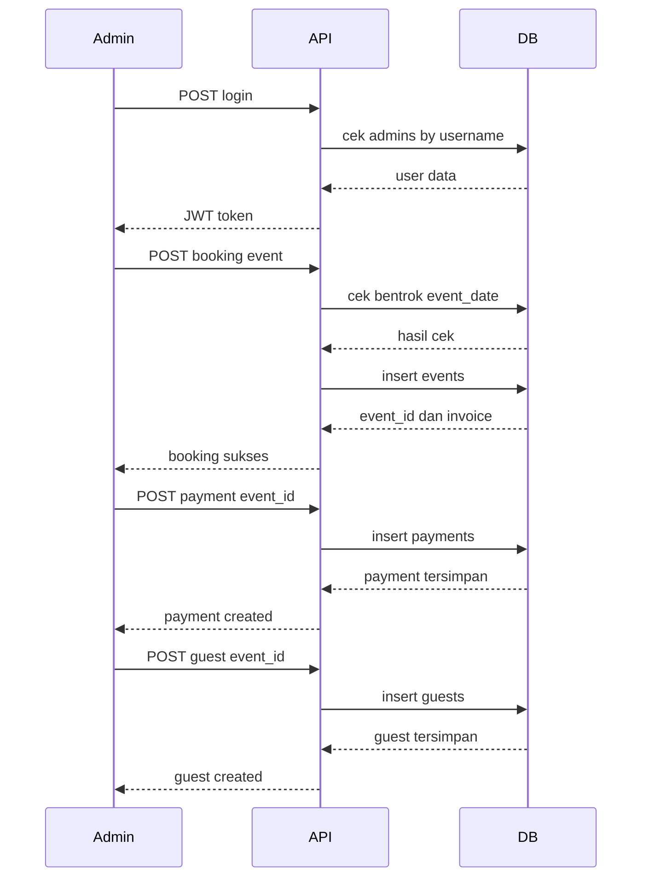
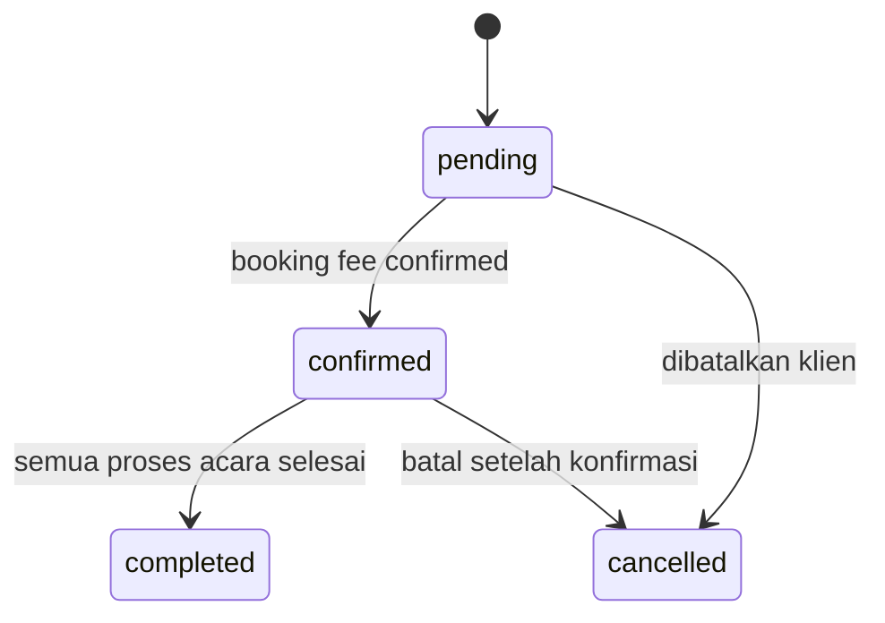
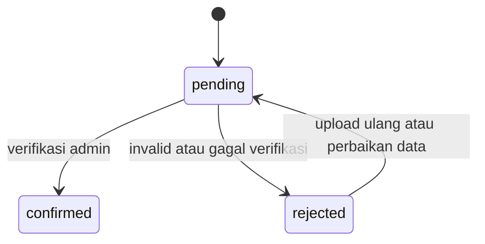
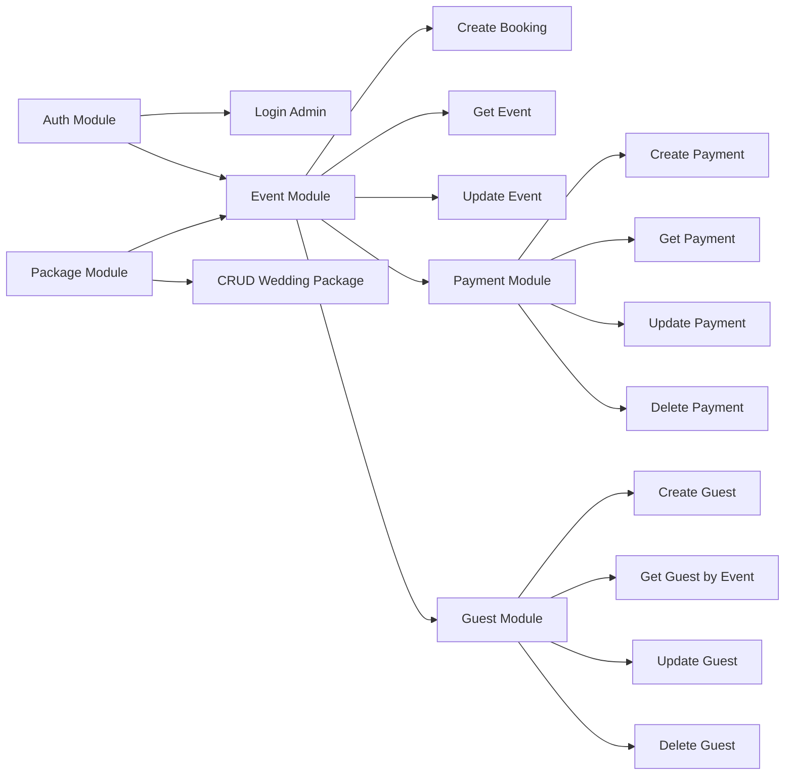

# Diagram Sistem Wedding Organizer

## 1) ERD Lengkap

## 2) Alur Bisnis End-to-End

## 3) Sequence Operasional Admin

## 4) State Diagram Event

## 5) State Diagram Payment

## 6) Peta Modul API

